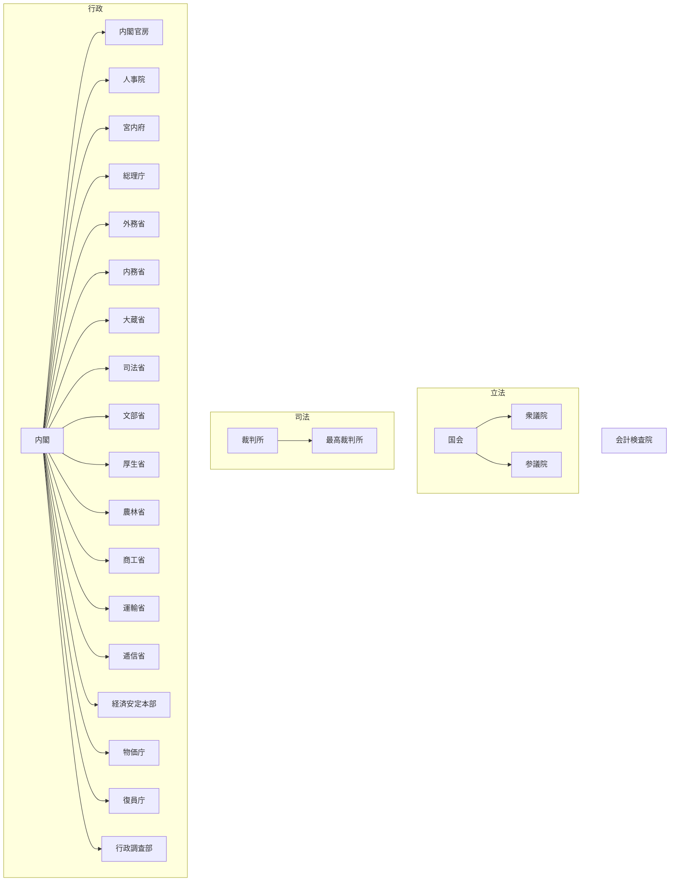

# 国の行政機関の組織図（Mermaid）

時点: 日本国憲法施行（昭和22年5月3日 / 1947-05-03）

出典粒度: [近代日本の官制](https://ja.wikipedia.org/wiki/近代日本の官制)（府省級）

## 全体概要

```mermaid
flowchart TB
  subgraph rippo["立法"]
    Diet["国会"]
    Diet --> Shugi["衆議院"]
    Diet --> Sangi["参議院"]
  end
  subgraph shihou["司法"]
    Court["裁判所"]
    Court --> Saiko["最高裁判所"]
  end
  subgraph gyosei["行政"]
    Cab["内閣"]
    Cab --> Kanbo["内閣官房"]
    Cab --> Jinji["人事院"]
    Cab --> Kunai["宮内府"]
    Cab --> Soricho["総理庁"]
    Cab --> Gaimu["外務省"]
    Cab --> Naimu["内務省"]
    Cab --> Okura["大蔵省"]
    Cab --> Shiho["司法省"]
    Cab --> Mombu["文部省"]
    Cab --> Kosei["厚生省"]
    Cab --> Norin["農林省"]
    Cab --> Shoko["商工省"]
    Cab --> Unyu["運輸省"]
    Cab --> Teishin["逓信省"]
    Cab --> Keizai["経済安定本部"]
    Cab --> Bukka["物価庁"]
    Cab --> Fukuin["復員庁"]
    Cab --> GyoseiChosa["行政調査部"]
  end
  Audit["会計検査院"]
```

## 出典

- 日本国憲法・内閣法・行政官庁法
- https://ja.wikipedia.org/wiki/近代日本の官制
