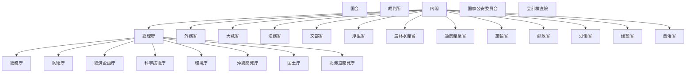

# 国の行政機関の組織図（Mermaid）

時点: 総務庁設置（昭和59年7月1日 / 1984-07-01）

出典粒度: 国会図書館再編年表（府省級）

## 全体概要

```mermaid
flowchart TB
  Diet["国会"]
  Court["裁判所"]
  Cab["内閣"]
  Cab --> Sorifu["総理府"]
  Sorifu --> SomuCho["総務庁"]
  Sorifu --> Boei["防衛庁"]
  Sorifu --> KeizaiKikaku["経済企画庁"]
  Sorifu --> Kagaku["科学技術庁"]
  Sorifu --> Kankyo["環境庁"]
  Sorifu --> Okinawa["沖縄開発庁"]
  Sorifu --> Kokudo["国土庁"]
  Sorifu --> Hokkaido["北海道開発庁"]
  Cab --> Gaimu["外務省"]
  Cab --> Okura["大蔵省"]
  Cab --> Homu["法務省"]
  Cab --> Mombu["文部省"]
  Cab --> Kosei["厚生省"]
  Cab --> Norin["農林水産省"]
  Cab --> Tsusan["通商産業省"]
  Cab --> Unyu["運輸省"]
  Cab --> Yusei["郵政省"]
  Cab --> Rodo["労働省"]
  Cab --> Kensetsu["建設省"]
  Cab --> Jichi["自治省"]
  NPA["国家公安委員会"]
  Audit["会計検査院"]
```

## 備考

- 行政管理庁などを再編して総務庁
- 農林省は昭和53年に農林水産省へ改称済み

## 出典

- https://dl.ndl.go.jp/pid/8243529
