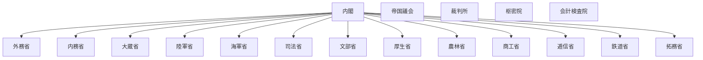

# 国の行政機関の組織図（Mermaid）

時点: 厚生省設置（昭和13年1月11日 / 1938-01-11）

出典粒度: 国会図書館再編年表（府省級）

## 全体概要

```mermaid
flowchart TB
  Cab["内閣"]
  Cab --> Gaimu["外務省"]
  Cab --> Naimu["内務省"]
  Cab --> Okura["大蔵省"]
  Cab --> Rikugun["陸軍省"]
  Cab --> Kaigun["海軍省"]
  Cab --> Shiho["司法省"]
  Cab --> Mombu["文部省"]
  Cab --> Kosei["厚生省"]
  Cab --> Norin["農林省"]
  Cab --> Shoko["商工省"]
  Cab --> Teishin["逓信省"]
  Cab --> Tetsudo["鉄道省"]
  Cab --> Takumu["拓務省"]
  Diet["帝国議会"]
  Court["裁判所"]
  Privy["枢密院"]
  Audit["会計検査院"]
```

## 出典

- https://dl.ndl.go.jp/pid/8243529
