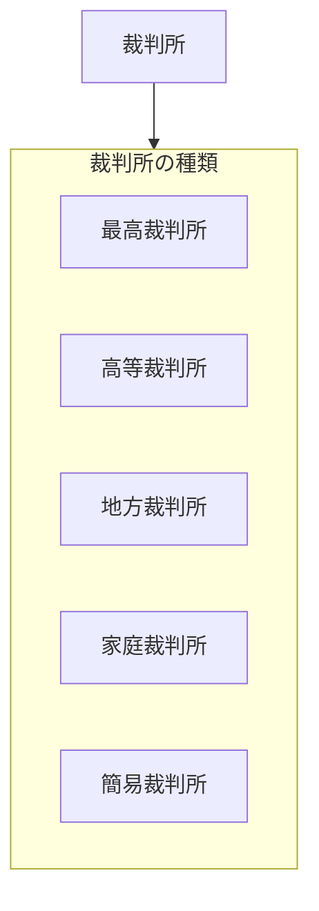

# 裁判所

出典: https://www.cas.go.jp/jp/gaiyou/jimu/jinjikyoku/satei_01_05.html

```mermaid
flowchart TB
  root["裁判所"]
  subgraph g0["裁判所の種類"]
    n0_0["最高裁判所"]
    n0_1["高等裁判所"]
    n0_2["地方裁判所"]
    n0_3["家庭裁判所"]
    n0_4["簡易裁判所"]
  end
  root --> g0
```
