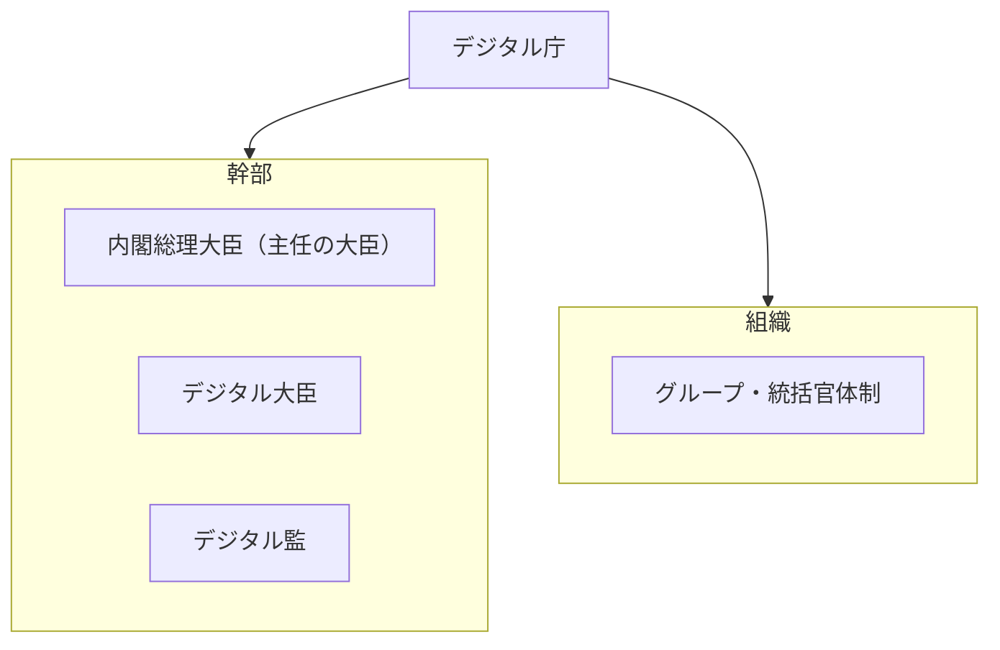

# デジタル庁

出典: https://laws.e-gov.go.jp/law/503AC0000000036

```mermaid
flowchart TB
  root["デジタル庁"]
  subgraph g0["幹部"]
    n0_0["内閣総理大臣（主任の大臣）"]
    n0_1["デジタル大臣"]
    n0_2["デジタル監"]
  end
  root --> g0
  subgraph g1["組織"]
    n1_0["グループ・統括官体制"]
  end
  root --> g1
```
