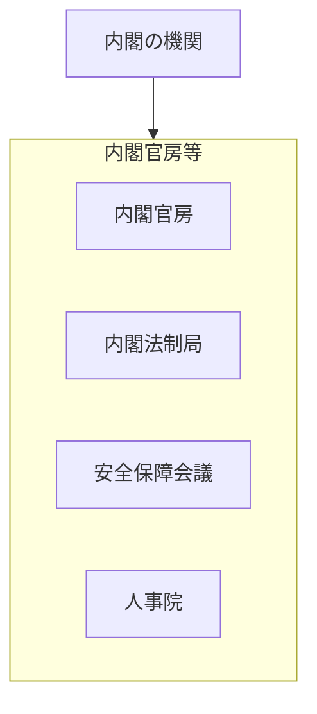

# 内閣の機関

出典: https://ja.wikipedia.org/wiki/%E5%A4%96%E5%B1%80 / https://ja.wikipedia.org/wiki/%E4%B8%AD%E5%A4%AE%E7%9C%81%E5%BA%81%E5%86%8D%E7%B7%A8 / 各設置法

```mermaid
flowchart TB
  root["内閣の機関"]
  subgraph g0["内閣官房等"]
    n0_0["内閣官房"]
    n0_1["内閣法制局"]
    n0_2["安全保障会議"]
    n0_3["人事院"]
  end
  root --> g0
```
