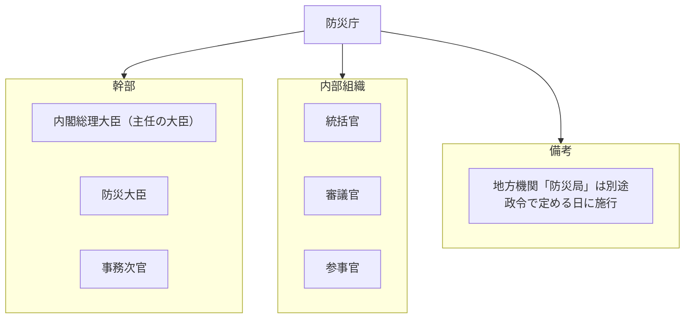

# 防災庁

出典: https://laws.e-gov.go.jp/law/508AC0000000061

```mermaid
flowchart TB
  root["防災庁"]
  subgraph g0["幹部"]
    n0_0["内閣総理大臣（主任の大臣）"]
    n0_1["防災大臣"]
    n0_2["事務次官"]
  end
  root --> g0
  subgraph g1["内部組織"]
    n1_0["統括官"]
    n1_1["審議官"]
    n1_2["参事官"]
  end
  root --> g1
  subgraph g2["備考"]
    n2_0["地方機関「防災局」は別途政令で定める日に施行"]
  end
  root --> g2
```
